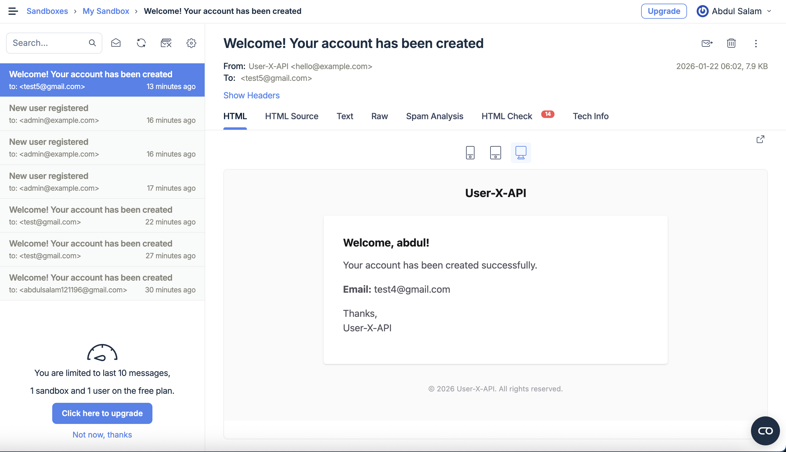
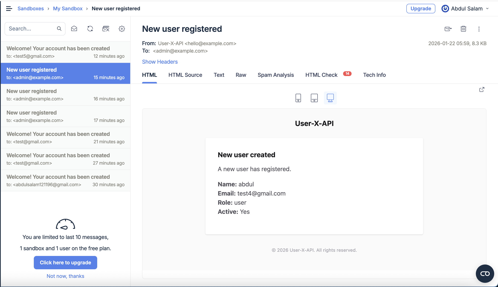
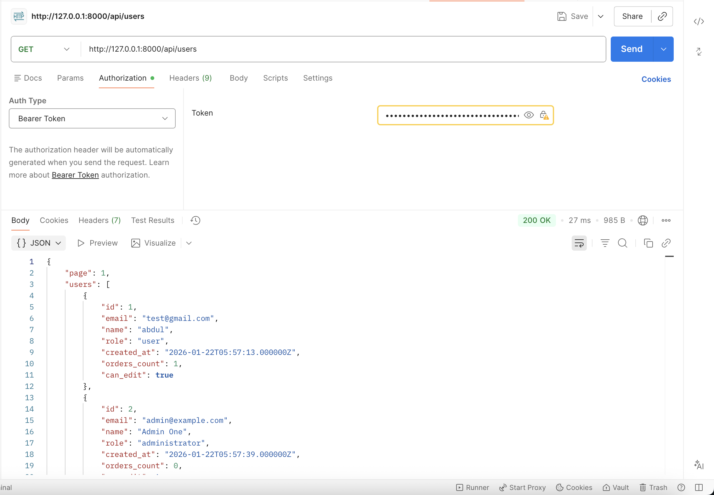

# User X API (Laravel 12)

**Author:** Abdul Salam  
**Tech Stack:** Laravel 12, PHP 8.5.2, SQLite, Laravel Sanctum (API Token Auth) 
**Purpose:** A clean, maintainable API implementation that prioritizes **clarity, structure, naming, and maintainability** over “perfect” output edge cases.

> **Guidance / Philosophy (for reviewers & candidates):**  
> The primary goal of this code is to demonstrate how clean was the code — focusing on clarity, structure, naming, and maintainability. The correctness of the final API result is less important than showing clean, well-organized logic that would be easy for another developer to understand and extend.

---

## Background & Goals

This project implements a small API for:
1. **Creating users** (with role defaults and basic validation).
2. **Logging in** to retrieve a **Bearer token** (Sanctum).
3. **Listing active users** with:
   - pagination (default **5 per page**)
   - search (`name` or `email`)
   - sorting (`name`, `email`, `created_at`)
   - `orders_count`
   - `can_edit` computed by the authenticated user’s role rules.

Additionally:
- After a user is created, the system sends **two emails** asynchronously:
  - to the new user (welcome email)
  - to all active administrators (notification email)

---

## Key Features

### Role Rules — `can_edit`
Rules are applied on user listing:

- **Administrator**: can edit **any** user.
- **Manager**: can edit only users with role **user**.
- **User**: can edit only **themselves**.

---

## Tools / Libraries Used

- **Laravel 12**
- **PHP 8.5.2**
- **Laravel Sanctum** — token-based authentication for API routes.
- **SQLite** — lightweight DB for fast local setup.
- **Laravel Queue (database driver)** — async email sending via queued listener.
- **Cache (file store)** — caching user list IDs per query/page (5 minutes).

---

## Database Setup (SQLite)

### Create SQLite database file
Create a file named:

```
database/database.sqlite
```

Example:
```bash
touch database/database.sqlite
```

### Environment configuration
In `.env`, set:
```env
DB_CONNECTION=sqlite
DB_DATABASE=/absolute/path/to/your/project/database/database.sqlite
```

> Tip: If you keep it relative, ensure Laravel resolves it correctly. Absolute path is safest.

---

## Database Indexing & Techniques

To keep listing fast (even on SQLite), indexes are aligned with query patterns.

### Users table
Recommended indexes:
- `users_active_created_at_idx` -> speeds up “active users sorted by created_at”
- `users_active_name_idx` -> helps search/sort (especially prefix searches)
- `users_active_email_idx` -> helps search/sort
- `users_role_active_idx` -> speeds up fetching admin recipients by role+active

### Orders table
- `orders_user_id_idx` → speeds up `withCount('orders')`

### Search note (SQLite performance)
Contains search (`%term%`) is convenient but less index-friendly.  
For maximum performance, prefer prefix search (`term%`) so indexes can help more often.

---

## How to Start

### 1) Requirements
- PHP **8.5.2**
- Composer
- SQLite installed/enabled for PHP

### 2) Install dependencies
```bash
composer install
```

### 3) Environment file
Copy `.env.example` to `.env`:
```bash
cp .env.example .env
```

Generate app key:
```bash
php artisan key:generate
```

### 4) Configure SQLite
Create:
```bash
touch database/database.sqlite
```

Update `.env`:
```env
DB_CONNECTION=sqlite
DB_DATABASE=/absolute/path/to/your/project/database/database.sqlite
```

### 5) Configure Cache (file store)
```env
CACHE_STORE=file
```

> Note: cache store values are lowercase. `FILE` will fail.

### 6) Configure Queue (database driver)
```env
QUEUE_CONNECTION=database
```

Create queue tables:
```bash
php artisan queue:table
php artisan migrate
```

### 7) Configure Mailtrap Sandbox (for testing emails)
In `.env` set Mailtrap SMTP credentials (Sandbox):
```env
MAIL_MAILER=smtp
MAIL_HOST=YOUR_MAILTRAP_HOST
MAIL_PORT=YOUR_MAILTRAP_PORT
MAIL_USERNAME=YOUR_MAILTRAP_USERNAME
MAIL_PASSWORD=YOUR_MAILTRAP_PASSWORD
MAIL_ENCRYPTION=tls
MAIL_FROM_ADDRESS="hello@example.com"
MAIL_FROM_NAME="User X API"
```

Clear cache after env changes:
```bash
php artisan optimize:clear
```

### 8) Run migrations + seed sample data
```bash
php artisan migrate:fresh --seed
```

### 9) Run the app
```bash
php artisan serve
```

### 10) Run queue worker (important for emails)
In a separate terminal:
```bash
php artisan queue:work
```

---

## Code Structure & Design Perspective

This project is intentionally structured for readability and maintainability.

### Controller
**Purpose:** HTTP boundary only.
- Receives request
- delegates to service/repository
- returns Resource/JSON response

### Request (FormRequest)
**Purpose:** Validation + normalization.
- Ensures query/body input is valid and consistent
- Keeps controllers clean

### Service
**Purpose:** Business orchestration.
- Responsible for workflow:
  - create user
  - fire event
  - bump cache version (optional invalidation)

### Repository
**Purpose:** DB access only.
- Centralizes query building and DB interactions
- Keeps services/controllers free from query details

### Model
**Purpose:** Represents DB entities and relations.
- User ↔ Orders relationship used for `withCount('orders')`

### Event
**Purpose:** Signals that something happened.
- `UserCreated` event is fired after user creation

### Listener (Queued)
**Purpose:** Side effects (async).
- Sends emails without blocking API response
- Uses `ShouldQueue` so it runs in background queue worker

### Resources
**Purpose:** Response formatting.
- Keeps response shape stable and consistent
- Prevents leaking sensitive fields like password

---

## Flow / Interconnection Overview

### Create User flow
1. `POST /api/users`
2. `StoreUserRequest` validates input
3. `UserService` creates the user via `UserRepository`
4. `UserCreated` event dispatched
5. `SendUserCreatedEmails` listener runs (queued)
6. Listener sends:
   - `UserCreatedMail` to the new user
   - `AdminNewUserMail` to all admins from DB (`role=administrator`, `active=true`)

### Login flow
1. `POST /api/login`
2. `LoginRequest` validates input
3. `AuthService` verifies credentials
4. Creates Sanctum token
5. Returns token + user (via `UserAuthResource`)

### List Users flow (requires login)
1. `GET /api/users` with `Authorization: Bearer <token>`
2. `ListUsersRequest` validates query params
3. Repository fetches active users (and optionally uses cache)
4. `UserListResource` maps response fields + `can_edit`
5. Returns `{ page, users: [] }`

---

## API Endpoints

### 1) Create User
**POST** `/api/users`  
Creates a user and queues email notifications.

**Payload**
```json
{
  "email": "user1@example.com",
  "password": "password123",
  "name": "Abdul Salam"
}
```

**Response (201)**
```json
{
  "id": 1,
  "email": "user1@example.com",
  "name": "Abdul Salam",
  "created_at": "2026-01-22T04:23:36.000000Z"
}
```

---

### 2) Login
**POST** `/api/login`  
Returns Sanctum token.

**Payload**
```json
{
  "email": "admin@example.com",
  "password": "password123"
}
```

**Response (200)**
```json
{
  "token": "1|xxxxxxxxxxxxxxxxxxxx",
  "user": {
    "id": 1,
    "email": "admin@example.com",
    "name": "Admin One",
    "role": "administrator"
  }
}
```

---

### 3) List Users (Auth Required)
**GET** `/api/users`  
Requires:
```
Authorization: Bearer <token>
```

**Query Params**
- `search` (optional) — search by name/email
- `page` (optional, default 1)
- `sortBy` (optional) — allowed: `name`, `email`, `created_at`
- `perPage` (optional, default 5)

Example:
```
GET /api/users?search=abd&page=1&sortBy=created_at&perPage=5
```

**Response**
```json
{
  "page": 1,
  "users": [
    {
      "id": 1,
      "email": "abcd@example.com",
      "name": "abdul salam",
      "role": "user",
      "created_at": "2026-01-22T04:23:36.000000Z",
      "orders_count": 3,
      "can_edit": true
    }
  ]
}
```

---

## Optimization Notes

### 1) Pagination
- Default **5 per page**, configurable via `perPage`
- Keeps payload small and predictable

### 2) Database Indexes
- Focused indexes for:
  - active listing
  - sorting fields
  - admin lookup for email notifications
  - order counting per user

### 3) Cache Mechanism (5 minutes)
To speed repeated list requests:
- Cache only **IDs** per `(search, sortBy, page, perPage)`
- TTL: **5 minutes**
- Fetch full user records by cached IDs and keep ordering

**Invalidation strategy:**
- Increment a global cache version key after user create/update
- Prevents needing to delete many file cache keys

---

## Queue & Failed Job Debugging

### Start worker
```bash
php artisan queue:work
```

### Failed jobs table
```bash
php artisan queue:failed-table
php artisan migrate
```

### View failed jobs
```bash
php artisan queue:failed
php artisan queue:failed --id=1
```

### Retry / clear
```bash
php artisan queue:retry all
php artisan queue:flush
```

### Logs
```bash
tail -f storage/logs/laravel.log
```

---

## Result Screenshots

- User mail success: `public/results/user.png`
- Admin mail success: `public/results/admin.png`
- List users (with can_edit): `public/results/list-users.png`

Then reference them here:

  
  


---

## Notes for Reviewers

This project is intentionally implemented with:
- clear file boundaries (Request / Controller / Service / Repository)
- async behavior via queued listener
- simple caching technique for read endpoints
- stable and explicit response formats via Resources

by Abdul Salam